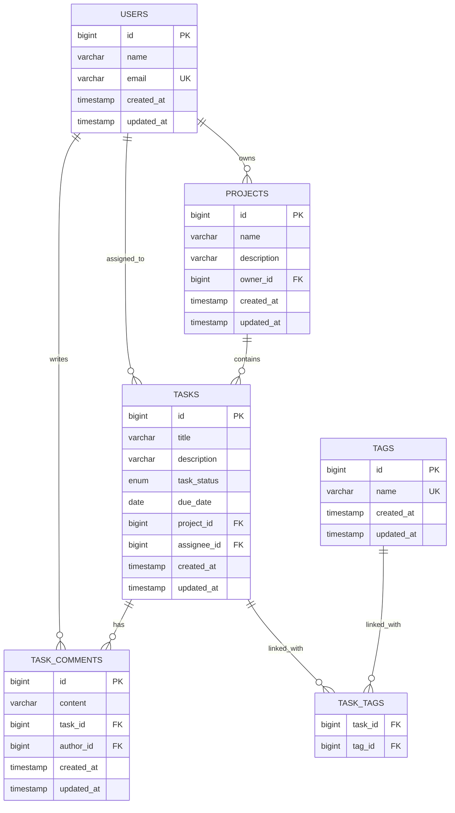

# Личный планировщик задач

[](https://sonarcloud.io/summary/new_code?id=xyzdevelopment0_pnayavu-personal-planner&branch=main)

REST-сервис на Spring Boot 3 для работы с задачами. Лабораторные требования наращиваются внутри одного реального task tracker, а не в виде отдельных учебных заготовок.

## Что реализовано

1. Подключена реляционная БД PostgreSQL.
2. Модель task tracker расширена до 5 сущностей:
   - `Task`
   - `Project`
   - `User`
   - `TaskComment`
   - `Tag`
3. Реализованы связи:
   - `OneToMany`: `Project -> Task`, `Task -> TaskComment`, `User -> Project`
   - `ManyToMany`: `Task <-> Tag`
4. Для сущностей реализованы CRUD операции через REST API.
5. Продемонстрирована проблема `N+1` и решение через `@EntityGraph`.
6. Добавлен сценарий сохранения нескольких связанных сущностей с частичным сохранением без `@Transactional` и полным rollback с `@Transactional`.
7. Добавлена ER-диаграмма с PK/FK и связями.
8. Добавлены сложные GET-запросы по `Task` с фильтрацией по вложенным сущностям через JPQL и native query.
9. Для поисковых запросов добавлены пагинация `Pageable`, in-memory индекс на `HashMap` и инвалидация кеша при изменении данных.
10. Добавлена глобальная обработка ошибок через `@ControllerAdvice`.
11. Добавлена валидация входных данных через `@Valid` и bean validation для path/query параметров.
12. Для всех endpoint настроен единый JSON-формат ошибки.
13. Логирование переведено на `logback` с уровнями логов и ротацией файлов.
14. Добавлен AOP-аспект для логирования времени выполнения сервисных методов.
15. Подключен Swagger UI с описанием endpoint и DTO.

## Стек

- Java 17
- Spring Boot 3.3.8
- Spring Web
- Spring Data JPA
- Spring AOP
- PostgreSQL
- Springdoc Swagger UI
- Testcontainers + PostgreSQL для интеграционных тестов
- Maven
- Checkstyle

## Запуск PostgreSQL

```bash
docker compose up -d
```

По умолчанию:

- host: `localhost`
- port: `5432`
- db: `planner`
- user: `planner`
- password: `planner`

Переменные окружения можно переопределить через `.env` по примеру из [`.env.example`](/Users/maximovich/personal/study/4/pnayavu/personal-planner/.env.example).

## Запуск приложения

```bash
mvn spring-boot:run
```

## Swagger

- Swagger UI: `http://localhost:8080/swagger-ui/index.html`
- JSON-спецификация: `http://localhost:8080/v3/api-docs`

## Логи

- текущий лог-файл: `logs/personal-planner.log`
- архивы логов: `logs/archive/`

Ротация настроена по дате и размеру файла. Уровни логирования и лимиты можно переопределить через переменные окружения `ROOT_LOG_LEVEL`, `APP_LOG_LEVEL`, `SQL_LOG_LEVEL`, `SQL_BIND_LOG_LEVEL`, `LOG_MAX_FILE_SIZE`, `LOG_MAX_HISTORY`.

## Проверка

```bash
mvn test
mvn verify
```

## Доменные сущности task tracker

- `Task` — основная сущность приложения
- `Project` — группирует задачи
- `User` — владелец проекта и исполнитель задачи
- `TaskComment` — комментарии к задаче
- `Tag` — метки задач

## ER-диаграмма



## Обоснование `CascadeType` и `FetchType`

### `Project -> Task`

- `cascade = CascadeType.ALL`
- `orphanRemoval = true`
- `fetch = LAZY`

Почему так:

- задачи являются частью проекта;
- при удалении проекта его задачи тоже должны удаляться;
- список задач не нужен при каждом чтении проекта.

### `Task -> TaskComment`

- `cascade = CascadeType.ALL`
- `orphanRemoval = true`
- `fetch = LAZY`

Почему так:

- комментарий живёт только вместе с задачей;
- при удалении задачи комментарии тоже должны удаляться;
- комментарии нужно подгружать только по запросу.

### `Task -> Tag`

- `fetch = LAZY`
- без каскадного удаления

Почему так:

- теги переиспользуются между задачами;
- удаление задачи не должно удалять общие теги;
- теги догружаются только в запросах, где реально нужны.

### `ManyToOne` связи

- `fetch = LAZY`
- без cascade

Почему так:

- дочерние сущности не должны управлять жизненным циклом родительских;
- eager для таких связей быстро раздувает граф загрузки и число SQL-запросов.

## API

### Tasks

- `POST /api/tasks`
- `GET /api/tasks`
- `GET /api/tasks/search/jpql`
- `GET /api/tasks/search/native`
- `GET /api/tasks/{id}`
- `PUT /api/tasks/{id}`
- `DELETE /api/tasks/{id}`

Пример:

```bash
curl -X POST http://localhost:8080/api/tasks \
  -H "Content-Type: application/json" \
  -d '{
    "title": "Prepare ER diagram",
    "description": "Draw PK/FK relations",
    "status": "TODO",
    "dueDate": "2026-03-20",
    "projectId": 1,
    "assigneeId": 1,
    "tagIds": [1, 2]
  }'
```

Пример поиска с фильтрацией по вложенным полям `project.name` и `project.owner.email`, пагинацией и индикатором кеша:

```bash
curl -i "http://localhost:8080/api/tasks/search/jpql?projectName=laboratory&ownerEmail=alice@example.com&status=TODO&page=0&size=1"
```

В ответе будет заголовок `X-Task-Search-Cache` со значением `MISS` или `HIT`.

## Формат ошибки

Все ошибки API возвращаются в одном формате:

```json
{
  "timestamp": "2026-04-01T18:42:31.123",
  "status": 400,
  "error": "Bad Request",
  "code": "VALIDATION_ERROR",
  "message": "Request validation failed",
  "path": "/api/users",
  "details": [
    {
      "field": "email",
      "message": "must be a well-formed email address"
    }
  ]
}
```

### Projects

- `POST /api/projects`
- `GET /api/projects`
- `GET /api/projects/{id}`
- `PUT /api/projects/{id}`
- `DELETE /api/projects/{id}`

### Users

- `POST /api/users`
- `GET /api/users`
- `GET /api/users/{id}`
- `PUT /api/users/{id}`
- `DELETE /api/users/{id}`

### Comments

- `POST /api/comments`
- `GET /api/comments`
- `GET /api/comments/{id}`
- `PUT /api/comments/{id}`
- `DELETE /api/comments/{id}`

### Tags

- `POST /api/tags`
- `GET /api/tags`
- `GET /api/tags/{id}`
- `PUT /api/tags/{id}`
- `DELETE /api/tags/{id}`

## Диагностические endpoints для JPA

Эти endpoints нужны для наглядной демонстрации поведения транзакций на реальных вставках в PostgreSQL.

### Транзакции

- `POST /api/tasks/diagnostics/transactions/without-transaction`
- `POST /api/tasks/diagnostics/transactions/with-transaction`

Оба endpoint запускают один и тот же сценарий:

1. создаётся пользователь
2. создаётся проект
3. создаётся задача
4. операция завершается исключением

Разница только в transactional-границе:

- `without-transaction` выполняет шаги без общей `@Transactional`, поэтому `users`, `projects` и `tasks` успевают сохраниться
- `with-transaction` выполняет те же шаги внутри общей `@Transactional`, поэтому после исключения все вставки откатываются

В ответе возвращается:

- `marker` для поиска строк в БД
- `rollbackApplied` чтобы сразу увидеть, был ли rollback
- `persistedUsers`, `persistedProjects`, `persistedTasks`, `persistedComments` чтобы сравнить итоговое состояние

Как увидеть это в БД:

1. Подними Postgres: `docker compose up -d`
2. Запусти приложение
3. Вызови один из endpoints, например:

```bash
curl -X POST http://localhost:8080/api/tasks/diagnostics/transactions/without-transaction
```

4. Скопируй `marker` из ответа
5. Открой PostgreSQL:

```bash
docker exec -it personal-planner-postgres psql -U planner -d planner
```

6. Выполни запросы с этим `marker`:

```sql
select id, name, email from users where email ilike '%' || '<marker>' || '%';
select id, name from projects where name ilike '%' || '<marker>' || '%';
select id, title from tasks where title ilike '%' || '<marker>' || '%';
select id, content from task_comments where content ilike '%' || '<marker>' || '%';
```

Для `without-transaction` ты увидишь строки в `users`, `projects` и `tasks`. Для `with-transaction` все четыре запроса вернут пустой результат.

## Тесты

Тест [TaskDiagnosticsIntegrationTest](/Users/maximovich/personal/study/4/pnayavu/personal-planner/src/test/java/com/maximovich/planner/task/diagnostics/TaskDiagnosticsIntegrationTest.java) проверяет:

- частичное сохранение без `@Transactional`
- полный rollback с `@Transactional`
